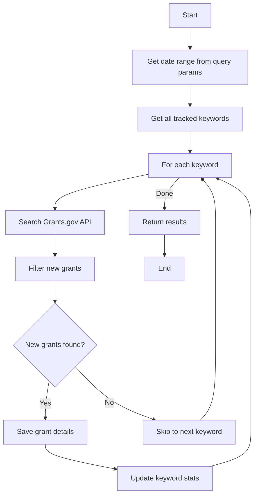
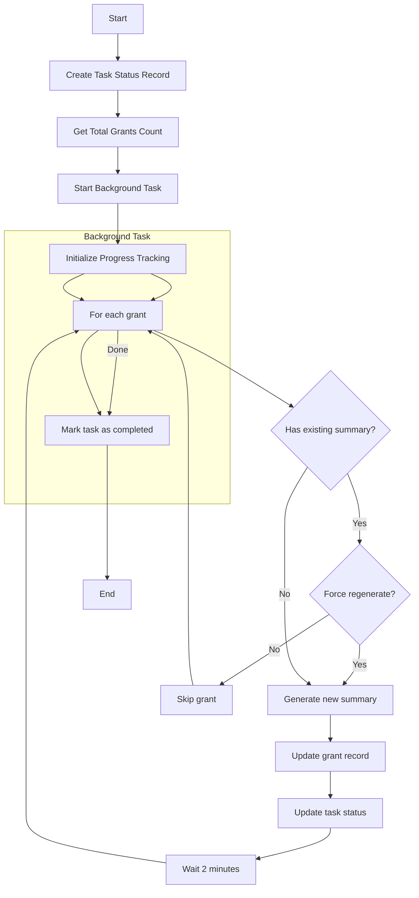
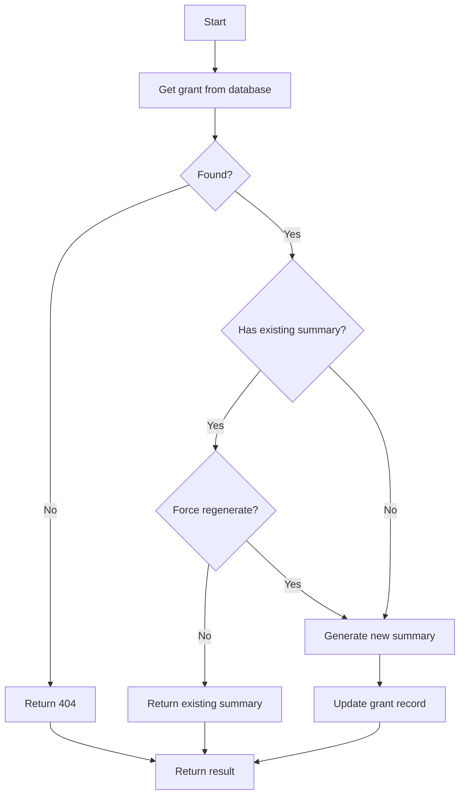
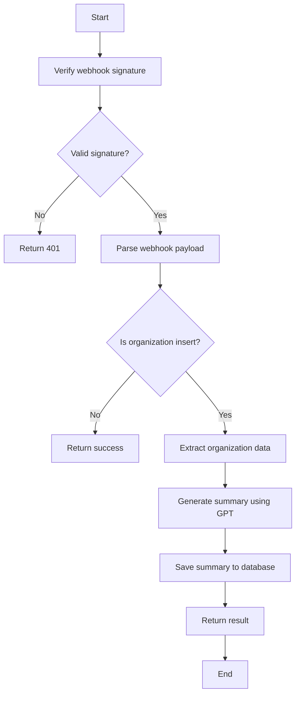
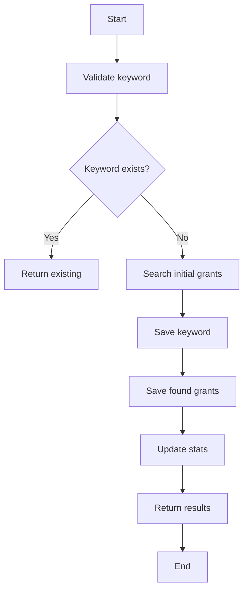
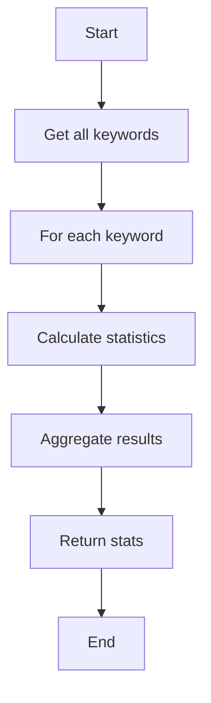
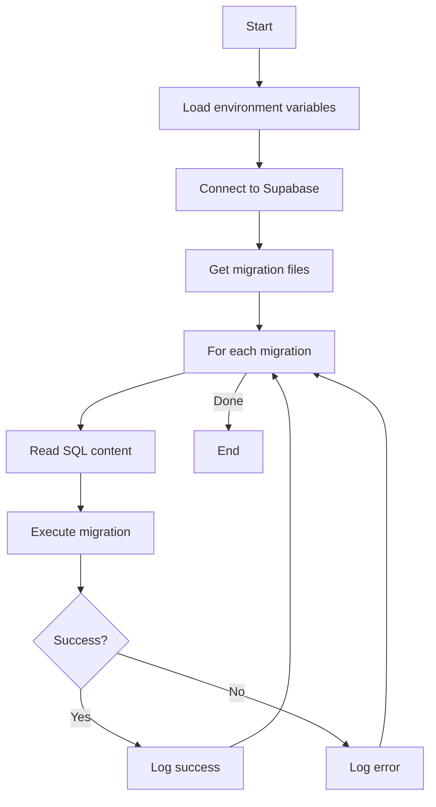

# API Workflows

This document outlines the workflows and algorithms for each endpoint in the Grant Watchers API.

## 1. Grant Management Endpoints

### 1.1 Check New Grants for Keywords (`POST /api/v1/keywords/check-new-grants`)



**Algorithm:**
1. Receive date range parameter (default: 5 days)
2. Retrieve all tracked keywords from database
3. For each keyword:
   - Search Grants.gov API for matching grants
   - Filter out already saved grants
   - Save new grant details to database
   - Update keyword statistics
4. Return summary of processed grants

### 1.2 Generate Grant Summaries (`POST /api/v1/grants/generate-summaries`)



**Algorithm:**
1. Create a background task status record in the database
2. Get total number of grants to process
3. Start an asynchronous background task that:
   - Processes one grant every 2 minutes
   - Skips grants that already have summaries (unless force_regenerate is True)
   - Updates progress in real-time in the database
   - Handles errors gracefully
   - Can be monitored and controlled via API endpoints

**Task Status Tracking:**
- Status can be one of: "running", "completed", "failed", "stopped"
- Tracks total items, processed items, failed items
- Records current item being processed
- Stores error messages if any
- Maintains timestamps for start, completion, and last update

**Monitoring and Control:**
1. Check task status:
   ```mermaid
   graph LR
       A[GET /task-status/{task_id}] --> B[Query Database]
       B --> C[Return Status]
   ```

2. View active tasks:
   ```mermaid
   graph LR
       A[GET /active-tasks] --> B[Query Running Tasks]
       B --> C[Return Task List]
   ```

3. Stop task:
   ```mermaid
   graph LR
       A[POST /stop-task/{task_id}] --> B[Cancel Task]
       B --> C[Update Status]
       C --> D[Cleanup Resources]
   ```

### 1.3 Generate Single Grant Summary (`POST /api/v1/grants/generate-summary/{grant_id}`)



**Algorithm:**
1. Retrieve the grant from the database
2. Check if it already has a summary
3. If no summary or force_regenerate is True:
   - Generate a new summary using Ollama
   - Update the grant record
4. Return the summary

## 2. Organization Management Endpoints

### 2.1 Organization Webhook Handler (`POST /api/v1/webhooks`)



**Algorithm:**
1. Verify incoming webhook signature
2. Parse webhook payload
3. If event is organization insert:
   - Extract organization details
   - Generate summary using OpenAI GPT
   - Save summary to organization record
4. Return processing result

## 3. Keyword Management Endpoints

### 3.1 Track New Keyword (`POST /api/v1/keywords/track`)



**Algorithm:**
1. Validate keyword input
2. Check if keyword already tracked
3. If new keyword:
   - Search Grants.gov for initial matches
   - Save keyword to database
   - Save found grants
   - Update keyword statistics
4. Return tracking results

### 3.2 Get Keyword Statistics (`GET /api/v1/keywords/stats`)



**Algorithm:**
1. Retrieve all tracked keywords
2. For each keyword:
   - Calculate total grants found
   - Calculate grants per time period
   - Gather success/failure rates
3. Return aggregated statistics

## 4. Database Migrations

### 4.1 Apply Migrations (`apply_migrations.py`)



**Algorithm:**
1. Load environment configuration
2. Establish Supabase connection
3. Get list of migration files
4. For each migration:
   - Read SQL content
   - Execute migration
   - Log results
5. Return migration status

## 5. Database Schema

### 5.1 Grants Table
- Basic grant information
- Search keywords
- Synopsis summary (JSONB)

### 5.2 Background Task Status Table
- Task ID (UUID)
- Task Type (VARCHAR)
- Status (VARCHAR)
- Progress tracking fields
- Timestamps
- Error information

## 6. Error Handling

### 6.1 Background Tasks
- Graceful error handling for individual grants
- Task status updates on failures
- Ability to retry failed items
- Task cancellation support

### 6.2 API Endpoints
- Proper HTTP status codes
- Detailed error messages
- Input validation
- Rate limiting protection

## 7. Performance Considerations

### 7.1 Rate Limiting
- 2-minute delay between grant summaries
- Ollama API rate limiting
- Database connection pooling

### 7.2 Resource Management
- Asynchronous task processing
- Background task cleanup
- Memory usage optimization
- Connection pooling

## Notes

- All endpoints include error handling and logging
- Database operations are wrapped in try-catch blocks
- Webhook signatures are verified for security
- Rate limiting is applied where appropriate
- Pagination is implemented for large result sets
