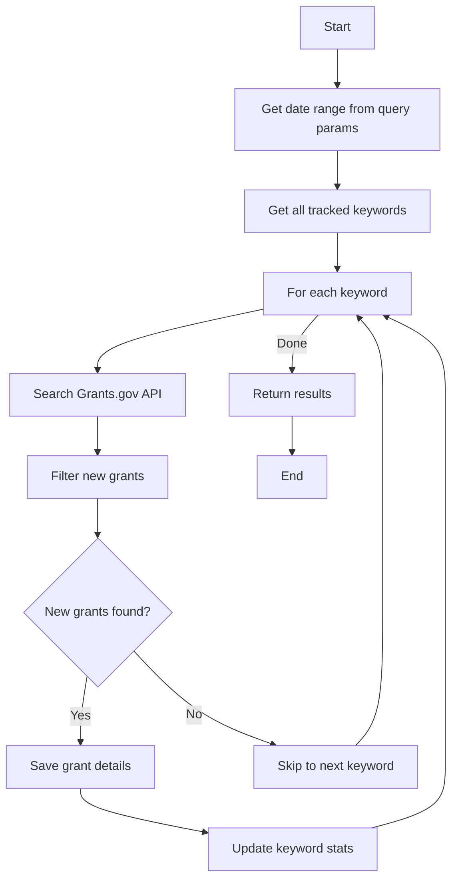
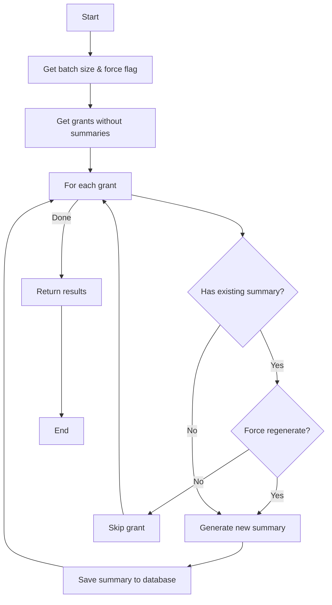
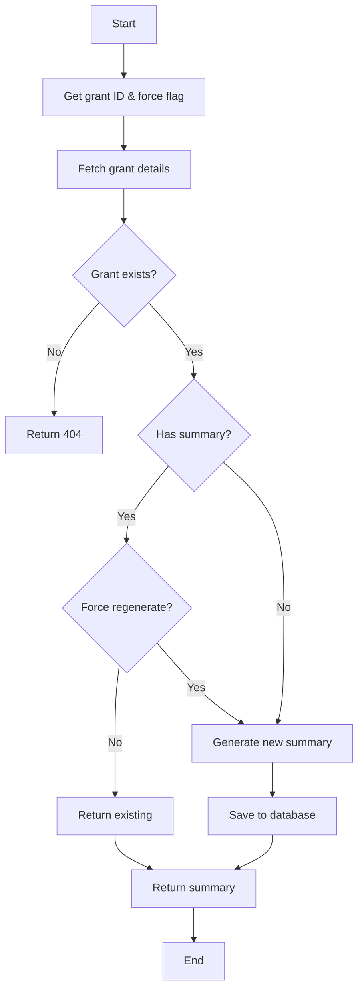
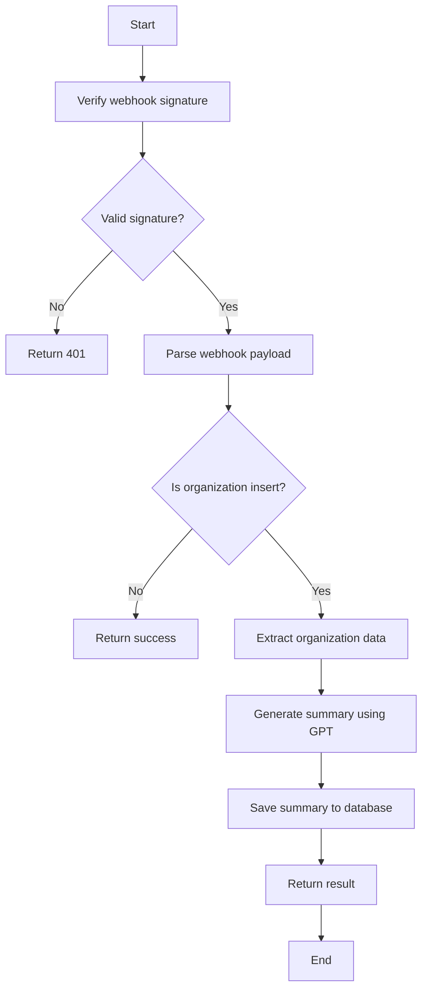
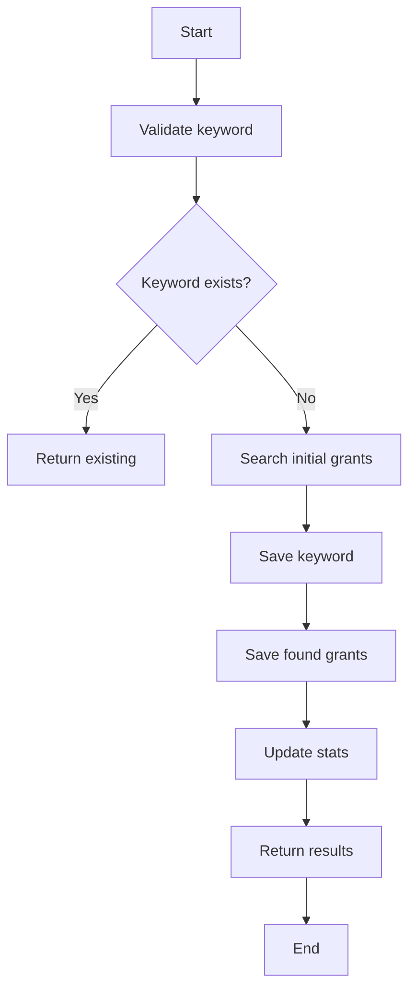
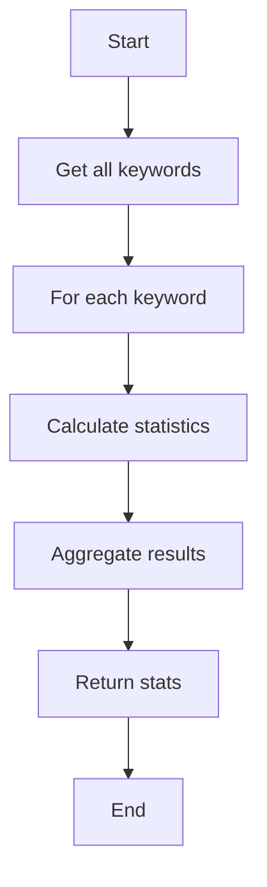
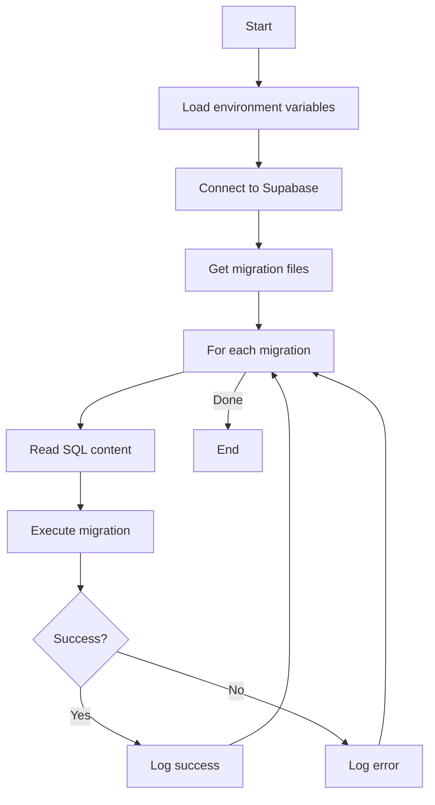

# API Workflows

This document outlines the workflows and algorithms for each endpoint in the Grant Watchers API.

## 1. Grant Management Endpoints

### 1.1 Check New Grants for Keywords (`POST /api/v1/keywords/check-new-grants`)

**Algorithm:**
1. Receive date range parameter (default: 5 days)
2. Retrieve all tracked keywords from database
3. For each keyword:
   - Search Grants.gov API for matching grants
   - Filter out already saved grants
   - Save new grant details to database
   - Update keyword statistics
4. Return summary of processed grants

### 1.2 Generate Grant Summaries (`POST /api/v1/grants/generate-summaries`)

**Algorithm:**
1. Accept batch size and force_regenerate parameters
2. Retrieve grants without summaries (or all if force_regenerate)
3. For each grant:
   - Check if summary exists
   - If no summary or force_regenerate:
     - Generate summary using OpenAI
     - Save to database
4. Return processing results

### 1.3 Generate Single Grant Summary (`POST /api/v1/grants/generate-summary/{grant_id}`)

**Algorithm:**
1. Accept grant_id and force_regenerate parameters
2. Fetch grant details from database
3. If grant exists:
   - Check for existing summary
   - Generate new summary if none exists or force_regenerate is true
   - Save and return summary
4. Return 404 if grant not found

## 2. Organization Management Endpoints

### 2.1 Organization Webhook Handler (`POST /api/v1/webhooks`)

**Algorithm:**
1. Verify incoming webhook signature
2. Parse webhook payload
3. If event is organization insert:
   - Extract organization details
   - Generate summary using OpenAI GPT
   - Save summary to organization record
4. Return processing result

## 3. Keyword Management Endpoints

### 3.1 Track New Keyword (`POST /api/v1/keywords/track`)

**Algorithm:**
1. Validate keyword input
2. Check if keyword already tracked
3. If new keyword:
   - Search Grants.gov for initial matches
   - Save keyword to database
   - Save found grants
   - Update keyword statistics
4. Return tracking results

### 3.2 Get Keyword Statistics (`GET /api/v1/keywords/stats`)

**Algorithm:**
1. Retrieve all tracked keywords
2. For each keyword:
   - Calculate total grants found
   - Calculate grants per time period
   - Gather success/failure rates
3. Return aggregated statistics

## 4. Database Migrations

### 4.1 Apply Migrations (`apply_migrations.py`)

**Algorithm:**
1. Load environment configuration
2. Establish Supabase connection
3. Get list of migration files
4. For each migration:
   - Read SQL content
   - Execute migration
   - Log results
5. Return migration status

## Notes

- All endpoints include error handling and logging
- Database operations are wrapped in try-catch blocks
- Webhook signatures are verified for security
- Rate limiting is applied where appropriate
- Pagination is implemented for large result sets
